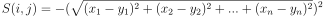
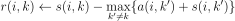
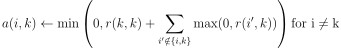
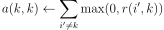
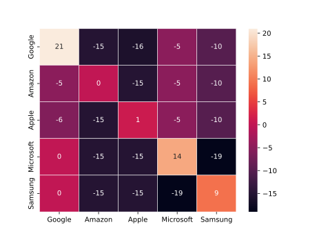
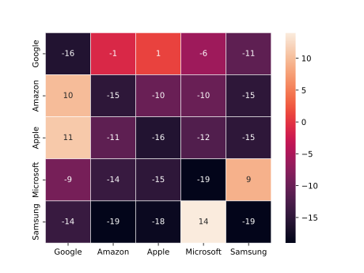
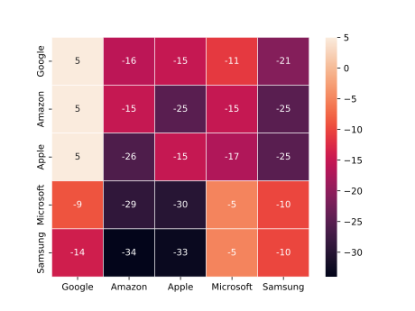
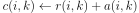

# Simple clustering cli tool for EDA
`Janus` is a small clustering tool useful for performing EDA on data.
Each algorithm in this tool is based around the following principles:
1. You don't know how many clusters you wish to end up with
2. You don't know which clustering algorithms best fits your data
3. You wish to understand as best as possible why the algorithm decided to perform the clustering in a certain way.

# Algorithms this tool knows how to perform
1. Affinity Propagation
2. DBSCAN and HDBSCAN
3. Mean Shift
4. OPTICS

# Explanations
The following subheadings will help provide some information as to the pros and cons of using each algorithm

Affinity Propagation

## History
This algorithm was published in 2007 in the journal science. (PMID: 17218491, DOI: 10.1126/science.1136800)

## How it works
Affinity Propagation works by finding exemplars in the data (members of the input set that are representative of clusters)
It takes as input the similarities between data points and identifies exemplars based on certain criteria.
Messages are exchanges between data points until the best set of exemplars are obtained.

### Example
Say we have the following table of participants:

| Name | Feature 1 | Feature 2 | Feature 3 | Feature 4 | Feature 5 |
| :---: | :---: | :---: | :---: | :---: | :---: |
| Google | 3 | 4 | 3 | 2 | 1 |
| Amazon | 4 | 3 | 5 | 1 | 1 |
| Apple | 3 | 5 | 3 | 3 | 3 |
| Microsoft | 2 | 1 | 3 | 3 | 2 |
| Samsung | 1 | 1 | 3 | 2 | 3 |

We need to calculate the following matrices:
1. **Similarity**
2. **Responsibility**
3. **Availability**
4. **Criterion**

Similarity Matrix

By default, the similarity matrix is defined as:
> the negative of the distance between two instances. (The greater the distance the smaller the similarity)
Or in mathematical terms:

If we take our example situation and draw a heat map out we get the following:

The values in the off diagonal elements will dictate the number of clusters formed. (The smaller the value, the fewer clusters obtained.)

It's important to note that even though we used `negative euclidean distance` as our similarity function, we don't have to.
We could have just as easily used something else, but the `negative euclidean distance` function is common in clustering
applications because it is an appropriate optimization function when the desired outcome is to minimize the squared error
between the `cluster members` and the `cluster exemplar`.

Responsibility Matrix

We need some way to figure out how well suited an element `k` is to be an exemplar for an element `i`. This is where the
responsibility matrix comes into play. Responsibility `r(i, k)` will quantify how well suited `k` is to be an exemplar for `i`
while also taking into account the nearest contender `k'` to be an exemplar for `i`.

Mathematically this can be expressed as:

> The responsibility matrix is initialized with zeros

The intuition behind the formula is simple, `r(i, k)` can be thought of as the relative similarity between `i` and `k`.
It essentially quantifies how similar `i` is to `k`, compared to `k'` while taking into account the availability of `k'`.
The responsibility of `k` to `i` will decrease as the availability of `k'` to `i` increases.

Availability Matrix

Availability can be described as:
> How appropriate is it for `i` to choose `k` as its exemplar

The availability of an element `i` takes into account the support of other elements `k` should be its exemplar.

Mathematically this can be expressed as:

Availability can be thought of as the self-responsibility of `k` + the sum of the positive responsibilities of `k` towards
elements other than `i`.

We only include positive responsibilities because an exemplar should positively explain at _least_ some data points well,
regardless of how poorly it explains other data points.

if self-responsibility is negative, it means that `k` is more suitable to belong to some other exemplar, rather than being an
exemplar. 

The maximum value of `a(i, k)` is 0.

self-availability can be calculated as follows:

`a(k ,k)` reflects the accumulated evidence that element `k` is suitable to be an exemplar.
This is based on the positive responsibilities of `k` towards other elements.

The `Responsibility` and `Availability` matrices are iteratively updated.
You may select when to terminate the procedure, although typically one of the following options is chosen:
* After a fixed number of iterations
* After changes in the values obtained fall below some threshold
* The values stay constant for some number of iterations

In this example, I chose to run the process till the values were constant and I got the following output:

#### Availability Matrix

#### Responsibility Matrix

Criterion Matrix

Once we finished updating the The `Responsibility` and `Availability` matrices, we can begin calculating
the `Criterion` matrix. The `Criterion` matrix `c` is the sum of the `Responsibility` matrix `r` and the `Availability` matrix
`a`.

If we sum up the `Availability` and `Responsibility` matrices we got previously we'd end up with a `Criterion` matrix that looks
like this:

The element with the highest Criterion value in each row would be designated to be an exemplar.
Elements in the rows sharing an exemplar are clustered together.

Essentially, an element `i` will be assigned to an exemplar `k` which is not only highly responsible but also highly available to `i`.
This relationship can be described mathematically as follows:

In our case `Google`, `Amazon`, `Apple` are clustered together, while `Microsoft` and `Samsung` are another one.

> **NOTE**: Since a distance metric is used to calculate similarities, 
> it is advised to standardize the parameters before clustering using Affinity Propagation.

## Use Cases

It's appropriate to use `Affinity Propagation` whenever there is a way to measure/compute a number for each pair of data
points, which indicates how similar they are (high values indicate high similarity whereas low values indicate low similarity).

Examples of using Affinity Propagation range from Analyzing network traffic, Analyzing basketball statistics, Identifying common trading patterns, and many more.

DBSCAN & HDBSCAN

## History
This algorithm was created in ... by ...

## How it works

## Use Cases
It was originally developed as a solution for ..., nowadays its mostly used as ...

| Pros | Cons |
| :---: | :---: |
| ... | ... |
| ... | ... |

