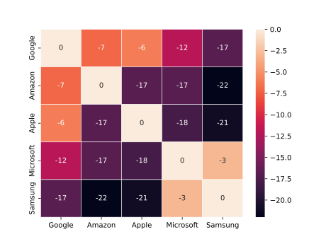

# Simple clustering cli tool for EDA
`Janus` is a small clustering tool useful for performing EDA on data.
Each algorithm in this tool is based around the following principles:
1. You don't know how many clusters you wish to end up with
2. You don't know which clustering algorithms best fits your data
3. You wish to understand as best as possible why the algorithm decided to perform the clustering in a certain way.

# Algorithms this tool knows how to perform
1. Affinity Propagation
2. DBSCAN and HDBSCAN
3. Mean Shift
4. OPTICS

# Explanations
The following subheadings will help provide some information as to the pros and cons of using each algorithm

Affinity Propagation

## History
This algorithm was published in 2007 in the journal science. (PMID: 17218491, DOI: 10.1126/science.1136800)

## How it works
Affinity Propagation works by finding exemplars in the data (members of the input set that are representative of clusters)
It takes as input the similarities between data points and identifies exemplars based on certain criteria.
Messages are exchanges between data points until the best set of exemplars are obtained.

### Example
Say we have the following table of participants:

| Name | Feature 1 | Feature 2 | Feature 3 | Feature 4 | Feature 5 |
| :---: | :---: | :---: | :---: | :---: | :---: |
| Google | 3 | 4 | 3 | 2 | 1 |
| Amazon | 4 | 3 | 5 | 1 | 1 |
| Apple | 3 | 5 | 3 | 3 | 3 |
| Microsoft | 2 | 1 | 3 | 3 | 2 |
| Samsung | 1 | 1 | 3 | 2 | 3 |

We need to calculate the following matrices:
1. **Similarity**
2. **Responsibility**
3. **Availability**
4. **Criterion**

Similarity Matrix

By default, the similarity matrix is defined as:
> the negative of the distance between two instances. (The greater the distance the smaller the similarity)
Or in mathematical terms:

If we take our example situation and draw a heat map out we get the following:

The values in the off diagonal elements will dictate the number of clusters formed. (The smaller the value, the fewer clusters obtained.)

It's important to note that even though we used `negative euclidean distance` as our similarity function, we don't have to.
We could have just as easily used something else, but the `negative euclidean distance` function is common in clustering
applications because it is an appropriate optimization function when the desired outcome is to minimize the squared error
between the `cluster members` and the `cluster exemplar`.

## Use Cases
It was originally developed as a solution for ..., nowadays its mostly used as ...

| Pros | Cons |
| :---: | :---: |
| ... | ... |
| ... | ... |

Affinity Propagation

## History
This algorithm was created in ... by ...

## How it works

## Use Cases
It was originally developed as a solution for ..., nowadays its mostly used as ...

| Pros | Cons |
| :---: | :---: |
| ... | ... |
| ... | ... |

